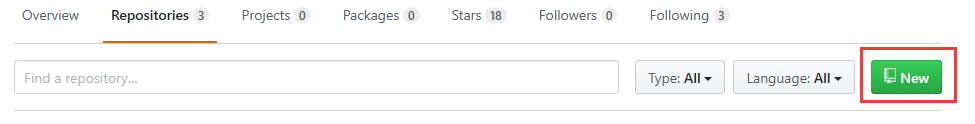
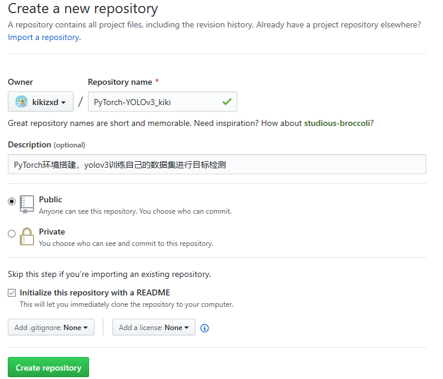
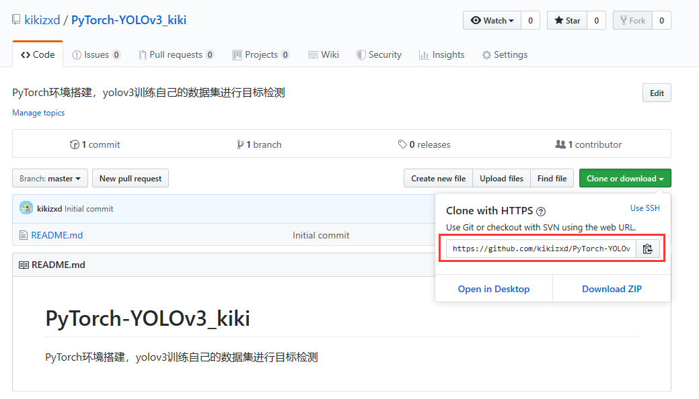
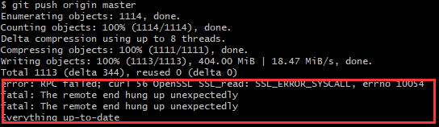

## 在Github上创建自己的Repositories并上传代码  ##
介绍本菜鸟怎么在Windows10系统上，登录Github，创建Repositories，上传代码。
### step1：下载安装Git客户端 ###
https://git-scm.com/downloads/
安装成功后电脑软件目录栏会出现


### step2：新建Repositories ###
1、打开登录自己的github



2、点击上图中“NEW”按键



3、填写后点击Create repository
这样就完成了仓库的新建。从下图可以看到该Repository里面已经有了一个“README.md”文件。在下面的操作中，我们将该Repository 拷贝到我们的本地计算机上。为了实现拷贝（clone）操作，我们需要记住下图中的地址（上图用红色标出的部分）



### step3：上传文件 ###
打开Git Bash
```
#进入用户自定义的文件夹，我的是D盘中的git_repo
cd /d/git_repo

#克隆step2创建的repo到git_repo
git clone https://github.com/kikizxd/PyTorch-YOLOv3_kiki.git

#进入到repo同名的文件夹下
cd PyTorch-YOLOv3_kiki

#将想要上传到GitHub的代码拷贝到本地计算机中的PyTorch-YOLOv3_kiki文件夹
#列出有变化的文件
git status

#将当前目录下所有改动的文件夹及文件添加到版本管理器
git add .

#提交到本地的版本控制库里，引号里面是你对本次提交的说明信息
git commit -m "first upload"

#将本地仓库提交到远程的GitHub中，这里会用到注册的用户名和密码
git push origin master
```
**<font color=red size=4>踩过的坑</font>**

**上传数据过大**



GitHub限制在1G，单个文件不能超过100M

**解决方法1：减小上传文件**
对于一些数据大的，可以保存在网盘或者云盘上，只提供链接下载即可

**解决方法2：使用Git Large File Storage**
下载大文件支持库：https://git-lfs.github.com
